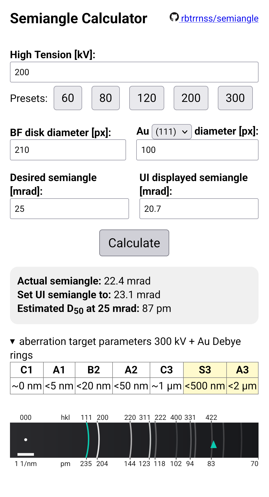

# Semiangle  
Browser based tool to calculate the semiangle for scanning transmission electron microscopy (STEM) experiments.

## Interface  
The interface works on desktops and mobile browsers, users need to provide basic reference parameters of the BF disk and Au (111) diameter, then the actual probe semi convergence angle can be calculated.  
Hovering over the aberration parameters shows additional hints by alt texts/tooltips. The calculation is done in javascript.  
  
 diameter, desired semiangle and the angle that the UI displays, there are also the results shown as well as a summary of desired aberration parameters") 
  
## Probe size estimation  
There is no physical model included here. The used formula and parameters were manually fitted, so it matches the estimated D50 of the CS corrector manufacturer.
